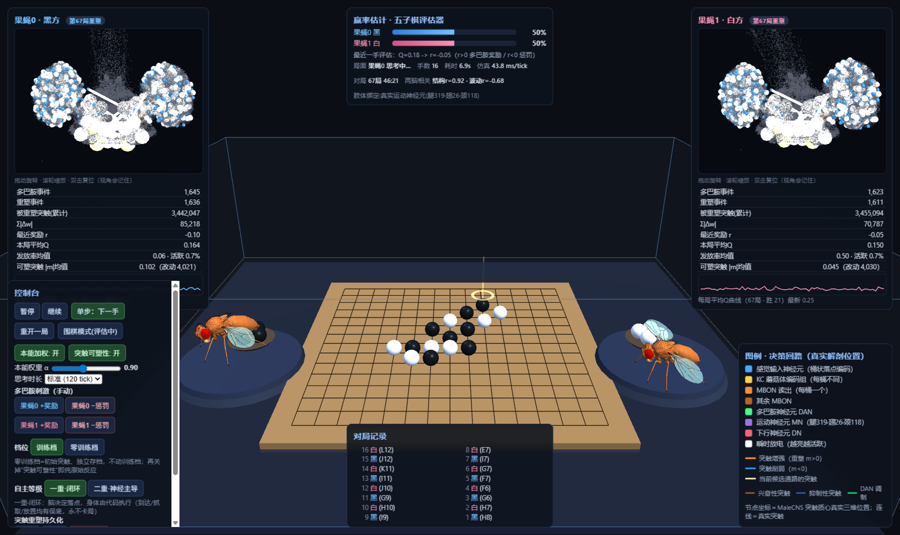

# flygo — 两只真实果蝇大脑对弈五子棋

两只果蝇各自驱动一副由 **MaleCNS v1.0 真实连接组**（166,700 神经元 / 25.58M 突触连接）
构建的 LIF 仿真大脑，在 3D 场景中对弈五子棋：候选落点经视觉通路编码、MBON 群体读出决定
落点，果蝇扇翅飞到棋盘上，用自己的腿部运动爆发信号抓起棋子、放到目标交叉点；外部五子棋
评估器为每一手打分，多巴胺脉冲经 38 个 DAN 广播到 KC→MBON 突触完成三因子可塑性学习。



## 运行

```bash
pip install numpy scipy
python server.py          # 打开 http://127.0.0.1:8765（纯 CPU，无需 GPU）
```

从零重建数据（可选；仓库已附带构建好的 `flygo_data.npz`）：

```bash
pip install pyarrow mujoco
python prepare_data.py    # 从 MaleCNS v1.0 feather 表构建 npz（路径为字面常量，按需修改）
python build_fly_model.py # 从 flybody（Apache-2.0）装配 MJCF 身体模型
```

## 结构

```
brain.py        LIF 双脑仿真 + 三因子 KC→MBON 可塑性 + 双蝇个体化（抖动/增益/码本）
game.py         五子棋对局状态机、候选点、持久化（训练档/零训练档分离）
judge.py        经典棋型评估器（Q∈[0,1]）与奖励映射 r=clip((Q−0.2)×2.5)
server.py       本地 HTTP 服务：仿真 tick、REST API、运动神经元绑定
web/            three.js 前端：真实解剖位置网络渲染、166,700 通道活动点云、自主等级切换
DESIGN.md       训练课程与自主性设计（L0–L5）
```

## 亮点

- **真实解剖**：166,576/166,700 神经元使用真实突触质心坐标；运动绑定使用真实运动神经元池（腿 319 / 翅 26 / 颈 118）。
- **双蝇个体化**：连接组抖动 σ=0.15、独立感觉增益、每蝇独立 KC 码本；独立性用 结构r（同底座高，正常）+ 波动r（−0.68~−0.11，动态独立）双指标度量。
- **自主三重阶梯**：一重=脑决策+代码执行闭环（看门狗保底）；二重=神经主导（归航 0.35 倍，抓/放只认自身运动爆发，失败自动重进近）；三重=完全物理交互（规划中）。
- **实测**：67 局训练 46:21；多巴胺事件 ~1,640/蝇；被重塑突触 ~3.47M/蝇；38–52 ms/tick，纯 CPU。

## 许可

- 代码：MIT（见 LICENSE）
- 数据：`flygo_data.npz` 为 MaleCNS v1.0（CC BY 4.0，Janelia FlyEM）的衍生数据，署名见 THIRD_PARTY_NOTICES.md
- three.js（MIT）、MuJoCo（Apache-2.0）、flybody（Apache-2.0）：见 THIRD_PARTY_NOTICES.md
